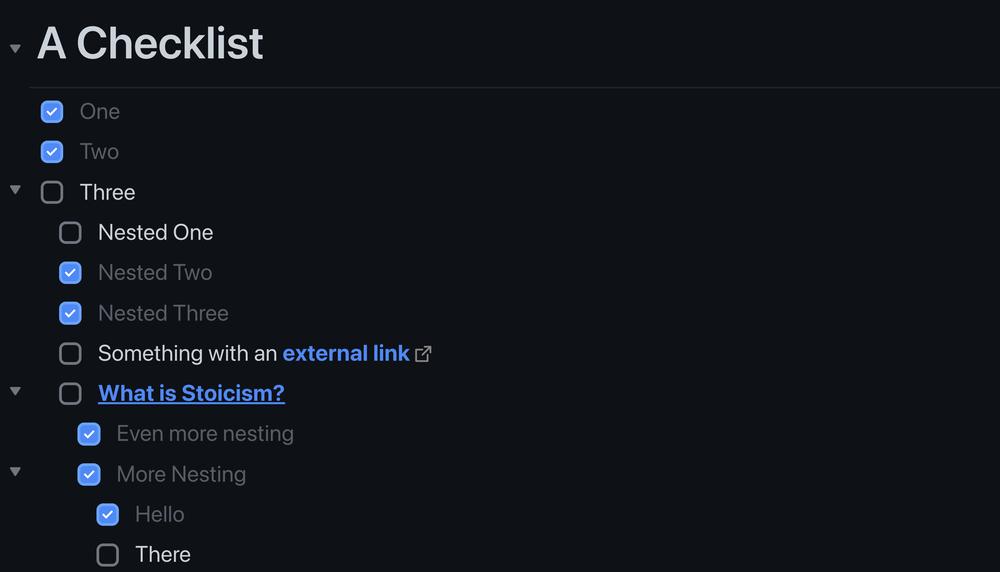
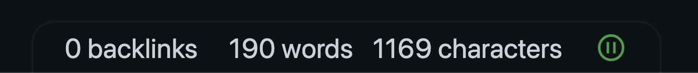

# Changelog

- [Changelog](#changelog)

## Description
I did not start a Changelog up until now, so please excuse the missing updates before `1.8.0`.

## 1.8.0 - Checkboxes

- Inspired by GitHub Design
- Clean and minimalistic
- Rounded edges
- A little animation to have a little fun crossing things off

Related issue: [#23](https://github.com/nikbrunner/obsidian-deep-work-theme/issues/23)

## 1.8.1 - Statusbar

Restyled the status-bar

- Placed absolute center-bottom center
- Takes only the width it needs
- Takes no space from the sides

Related issue: [#25](https://github.com/nikbrunner/obsidian-deep-work-theme/issues/25)

### 1.8.2 - Statusbar fixes

- Fixes [#43](https://github.com/nikbrunner/obsidian-deep-work-theme/issues/43)
- Removed bottom border
