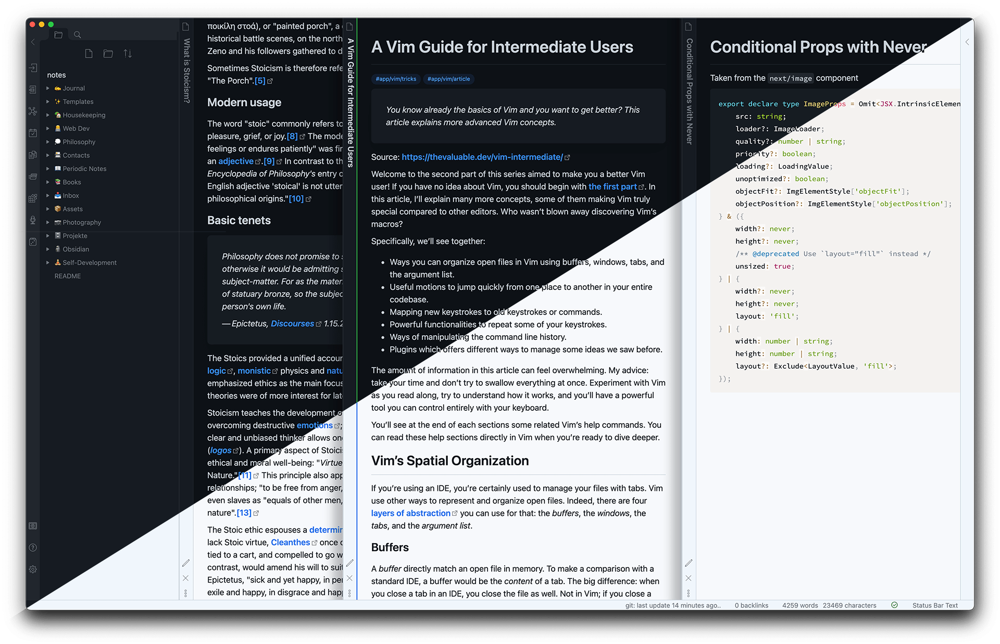

<div>
  <h1 align=center>⚠️  Development Status ⚠️ </h1>
  <p align="center">
    Please note that the development of this theme has <strong>currently on hold</strong>, since I am concentrating my limited time on <a href="https://github.com/terra-theme">another project</a>.
    <br />
    I will try to update it when I can, but also accept contributions.
  </p>
</div>

<div>
  <h1 align=center>Obsidian Deep Work Theme</h1>
  <p align="center">
    
    
    
    
  </p>

  <p align="center">A light and dark theme for <a href="https://obsidian.md">Obsidian</a> inspired by the modern GitHub colors.</p>

  <p align="center">
    
  </p>


  <p align="center">
    <a href="https://www.buymeacoffee.com/nikbrunner" target="_blank">
     
    </a>
  </p>

</div>

## Mobile

The theme is hardly different from the default theme except for the colors, so it works well on mobile too!

## Roadmap

- Dimmed, dark option to be enabled via a dedicated future PlugIn
- Support for Style Settings Plugin
- `publish.css`

## Fonts

The font-family declarations are taken directly from GitHub.

```css
:root {
  /* ... */
  --default-font: -apple-system, BlinkMacSystemFont, Segoe UI, Helvetica,
    Arial, sans-serif, Apple Color Emoji, Segoe UI Emoji;
  --editor-font: ui-monospace, SFMono-Regular, SF Mono, Menlo, Consolas,
    Liberation Mono, monospace;
  /* ... */
}
```
## Respected PlugIns

- Calendar
- Buttons
- Admonition
- Sliding Panes
- Todoist
- Jump-To-Date
- Kanban

## Install

- **Recommended**: You can install this theme very simply by downloading it from the Community Themes Finder from the [Obisidian](https://obsidian.md) settings. This also works on mobile.
- **Manuall**: You can download or clone this repository, rename the `obsidian.css` file to `Deep Work.css` and place it in your hidden `.obsidian/themes/` folder.
