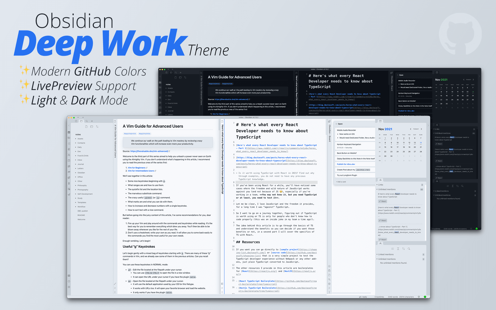

# Obsidian Deep Work Theme


A light and dark theme for [Obsidian](https://obsidian.md) inspired by the modern GitHub colors.

## Preview


## Development Stage
Although this theme is in a very early development, it is very usable.

## Future plans
- A dark dimmed option via a dedicated PlugIn
- A `publish.css`

## Fonts
The font-family declarations are taken directly from GitHub.

```css
:root {
  /* ... */
  --default-font: -apple-system, BlinkMacSystemFont, Segoe UI, Helvetica,
    Arial, sans-serif, Apple Color Emoji, Segoe UI Emoji;
  --editor-font: ui-monospace, SFMono-Regular, SF Mono, Menlo, Consolas,
    Liberation Mono, monospace;
  /* ... */
}
```

## Respected PlugIns
- Calendar
- Buttons
- Admonition
- Sliding Panes
